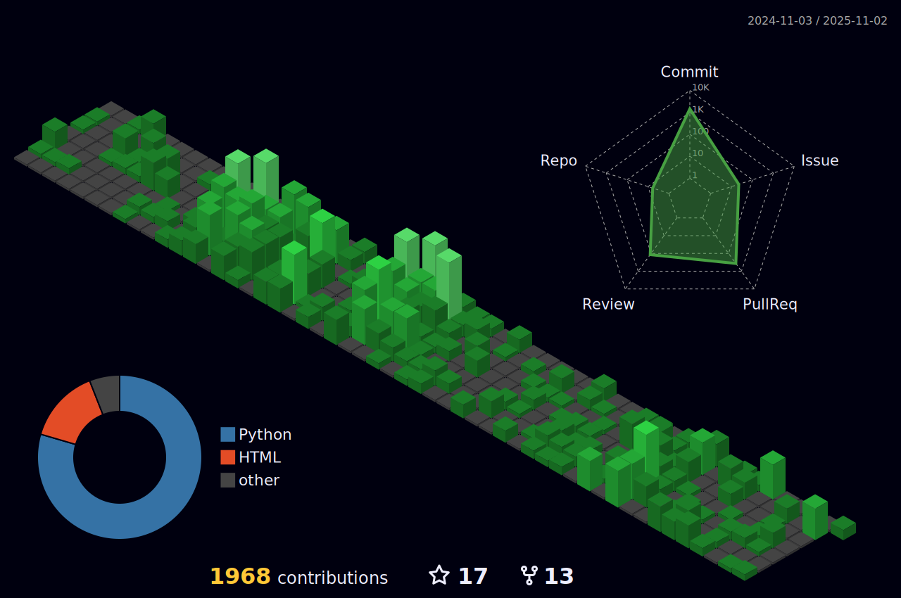

<!-- Welcome words -->
<h1 style="color: #c1ea09;">Welcome to Xinglong Zhang's GitHub Profile! 👋</h1>

<!-- World Peaceful words -->

<!-- Little Logo -->

  
  
  
  
  
  
       

<!--  -->

<!-- 

 -->

<!-- GitHub Activity Graph GitHub -->
<table>
  <tr>
    <td>
      <picture>
        <source media="(prefers-color-scheme: dark)"  srcset="https://github-readme-activity-graph.vercel.app/graph?username=xinglong-zhang&theme=tokyo-night" />
        <source media="(prefers-color-scheme: light)" srcset="https://github-readme-activity-graph.vercel.app/graph?username=xinglong-zhang" />
        
      </picture>
  </tr>
</table>

<<<<<<< HEAD

=======

>>>>>>> 311145150db0c5ba4b05269469ccfb3052522f19

We are a dynamic computational chemistry research group at [The Chinese University of Hong Kong (CUHK)](https://www.cuhk.edu.hk/). Our focus lies in developing automation tools to increase the efficiency of computational chemistry research. We apply quantum chemical simulations to understand organic and organometallic catalysis.

## 🔬 Research Focus

- **Automation Tools**: Enhancing efficiency in computational chemistry practices.
- **Catalysis Studies**: Exploring transition-metal catalyzed C–H functionalisation and organocatalytic asymmetric synthesis.
- **Small Molecule Activation**: Investigating small molecule activaion using green catalysis.
- **Machine Learning Applications**: Addressing complex chemical systems and studying dynamic effects on large scales.

*Discover more about our research [here](https://xinglong-zhang.github.io/research/).*

## 🏆 Recent News

- **Feb 2025**: Dr. Zhang received the [2025 Thieme Chemistry Journals Award](https://www.thieme.de/en/thieme-chemistry/thieme-chemistry-journals-awardees-107362.htm). Congratulations! 🎉
- **Jan 2025**: Awarded the Academic Equipment Grant (AEG) for 2024-25, securing HKD$1,536,000 to establish High Performance Computing Facilities at CUHK's IT Service Centre.
- **Dec 2024**: Presented at the [12th Singapore International Chemistry Conference (SICC-12)](https://sicc12.org/) in Singapore.

*Stay updated with our latest news [here](https://xinglong-zhang.github.io/).*

## 📚 Publications

Our group actively contributes to the scientific community. Explore our publications [here](https://xinglong-zhang.github.io/publications.html).

## 🎓 Teaching

We are committed to education and offer various courses. Learn more about our teaching endeavors [here](https://xinglong-zhang.github.io/teaching.html).

<!-- ## 📸 Gallery -->

<!-- A glimpse into our lab activities and events: -->

<!--  -->

<!-- *More photos available in our [gallery](https://xinglong-zhang.github.io/gallery.html).* -->

## 📬 Contact

**Address**:  
Run Run Shaw Science Building,  
The Chinese University of Hong Kong,  
Shatin, N.T., Hong Kong, China

**Email**: [xinglong.zhang@cuhk.edu.hk](mailto:xinglong.zhang@cuhk.edu.hk)

---

*Visit our official website: [xinglong-zhang.github.io](https://xinglong-zhang.github.io/)*

*Follow our updates on [LinkedIn](https://www.linkedin.com/in/xinglongzhang) and [Twitter](https://twitter.com/XZhangChem).*

<!--
**xinglong-zhang/xinglong-zhang** is a ✨ _special_ ✨ repository because its `README.md` (this file) appears on your GitHub profile.

Here are some ideas to get you started:

- 🔭 I’m currently working on ...
- 🌱 I’m currently learning ...
- 👯 I’m looking to collaborate on ...
- 🤔 I’m looking for help with ...
- 💬 Ask me about ...
- 📫 How to reach me: ...
- 😄 Pronouns: ...
- ⚡ Fun fact: ...
-->
